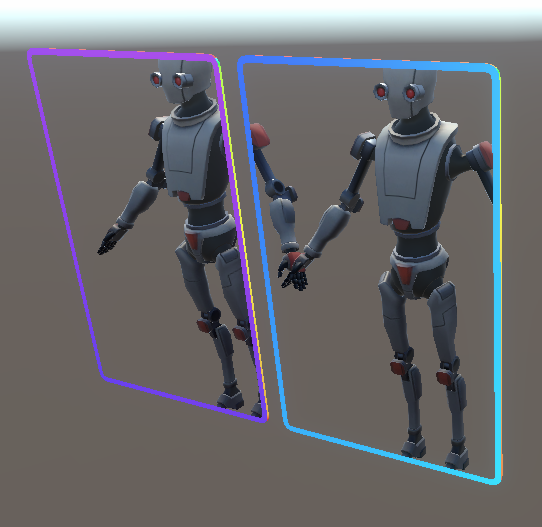

# Gwentlike Card & rpg UI

using stencil shader has problem that a card can contain another card content.
so i made ref value that applies to card and contents.
when content and card have same ref value content will be shown in card.

Using Shader Graph, Shader, Code in Unity6.

- Card and simple UI for card
<video controls loop = "" muted ="" autoplay = ""><source src ="https://github.com/kingJ0/kingJ0.github.io/raw/refs/heads/main/src/content/posts/video/Card&UI_001.mp4"></video>

