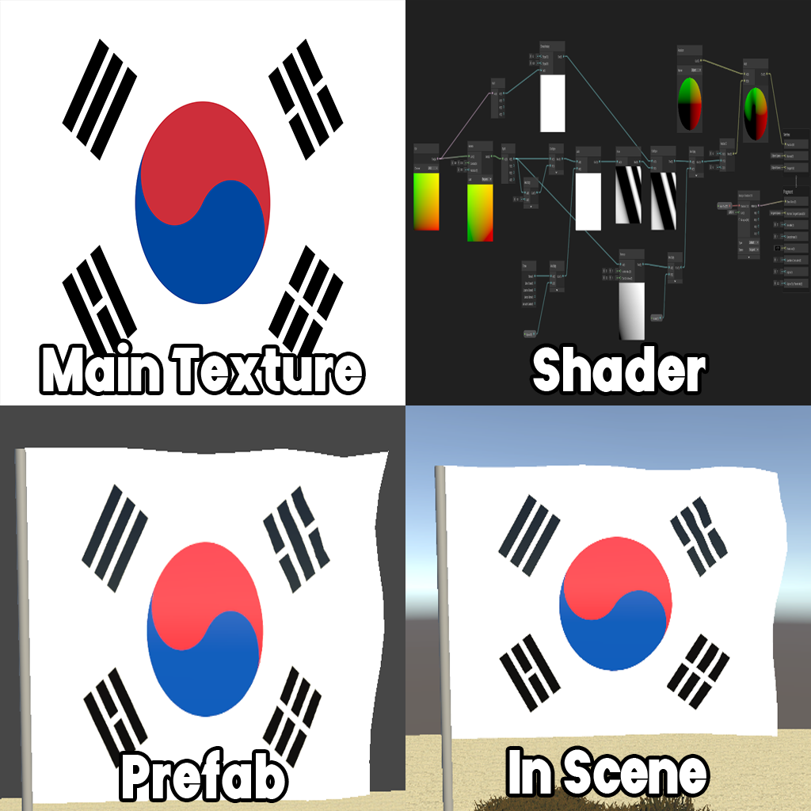
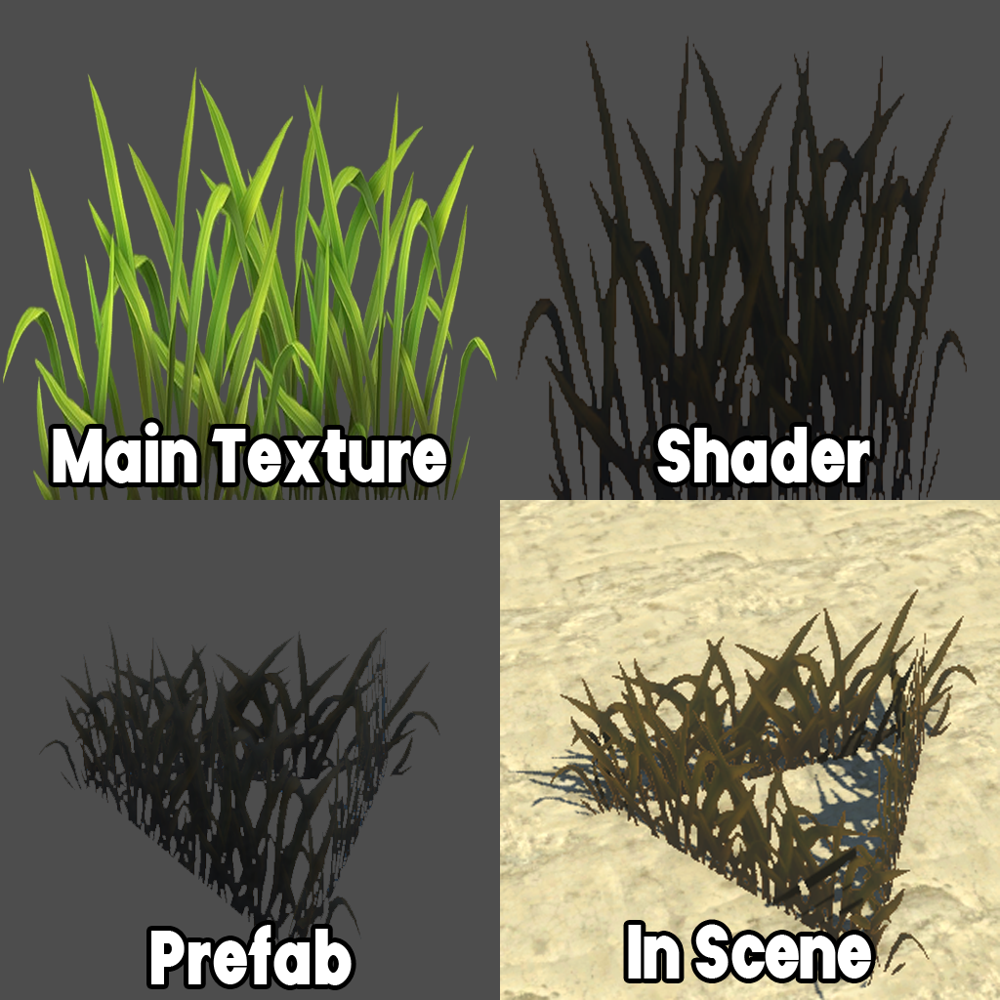
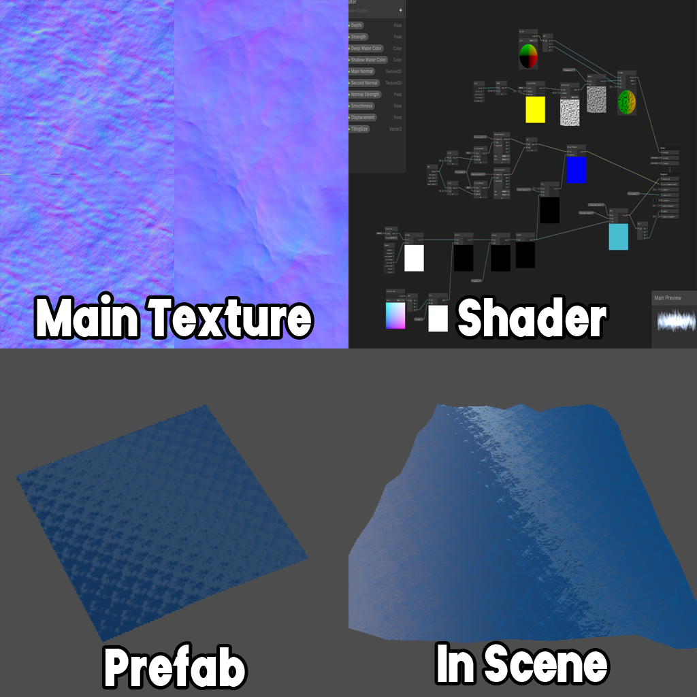

# Environment - Grass, Water, Flag
Simple environment with grass, water, and flag.
Made in Unity Shader Graph.

- Flag
  
<video controls loop = "" muted ="" autoplay = ""><source src ="https://github.com/kingJ0/kingJ0.github.io/raw/refs/heads/main/src/content/posts/video/Environment1.mp4"></video>

- Grass
- 
<video controls loop = "" muted ="" autoplay = ""><source src ="https://github.com/kingJ0/kingJ0.github.io/raw/refs/heads/main/src/content/posts/video/Environment2.mp4"></video>

- Water

<video controls loop = "" muted ="" autoplay = ""><source src ="https://github.com/kingJ0/kingJ0.github.io/raw/refs/heads/main/src/content/posts/video/Environment4.mp4.mp4"></video>

