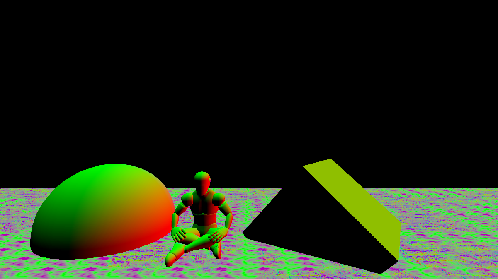
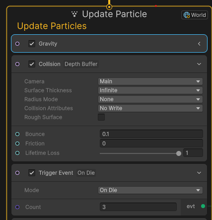

# Environment - Rain

Rain in Particle system, VFX Graph
Made in Unity

- Particle system
<video controls loop = "" muted ="" autoplay = ""><source src ="https://github.com/kingJ0/kingJ0.github.io/raw/refs/heads/main/src/content/posts/video/RainPS.mp4"></video>

- VFX Graph

Using DepthBuffer Collision and OnDie Event
<video controls loop = "" muted ="" autoplay = ""><source src ="https://github.com/kingJ0/kingJ0.github.io/raw/refs/heads/main/src/content/posts/video/RainVFXG.mp4"></video>

