# Buildings

이 에셋들은 [SCREAM JAM 2025](https://itch.io/jam/scream-jam-2025)에 참여하여 제출된 게임의 에셋입니다.

한국 컨셉의 호러, 추리게임으로 한국적인 건물, 경찰서의 내/외부의 제작을 요청받아 제작했습니다.

건물의 텍스처 2종, 도로 타일, 경찰서 내외부를 제작하였습니다.

---
These assets were created for a game submitted to the [SCREAM JAM 2025](https://itch.io/jam/scream-jam-2025).

I was tasked with creating assets for a Korean-concept horror mystery game, specifically Korean-style buildings and the interior/exterior of a police station.

I created two types of building textures, road tiles, and the interior and exterior of the police station.

---

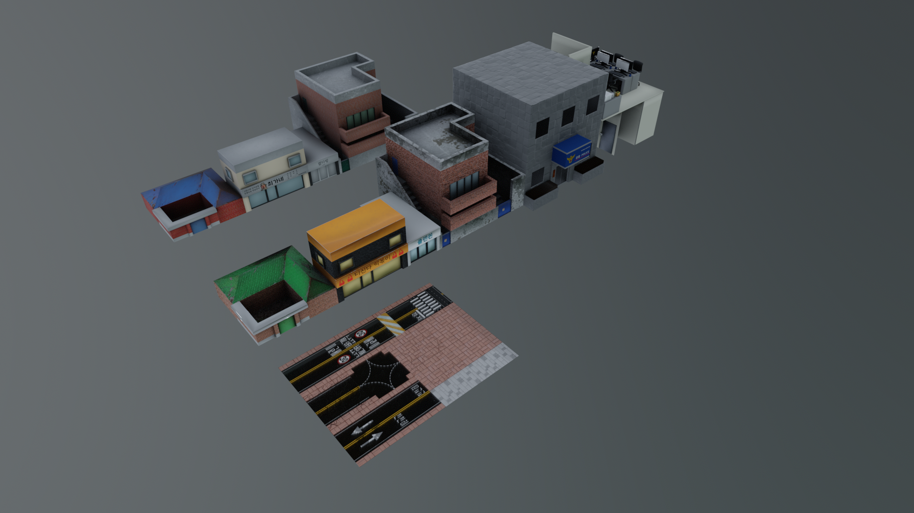
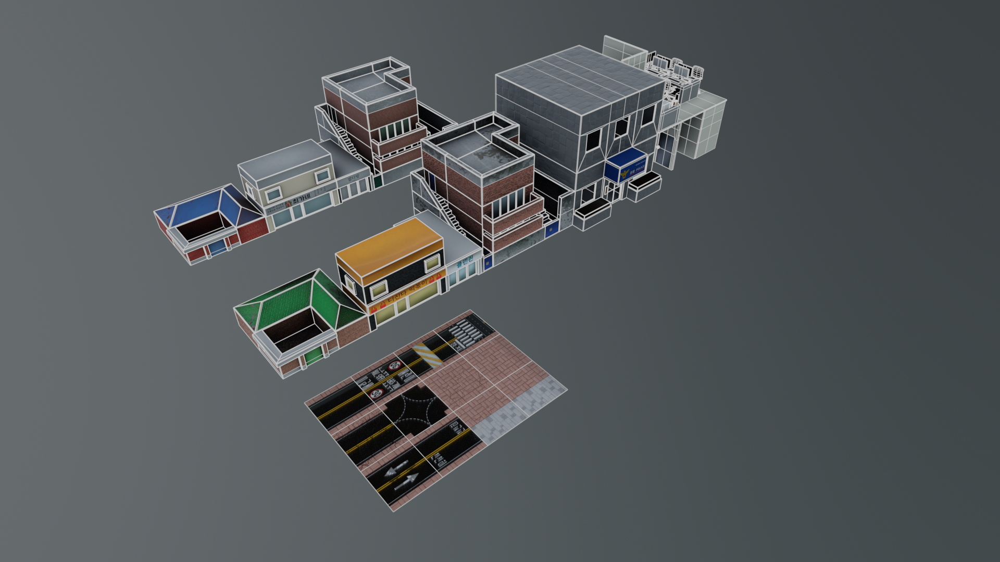
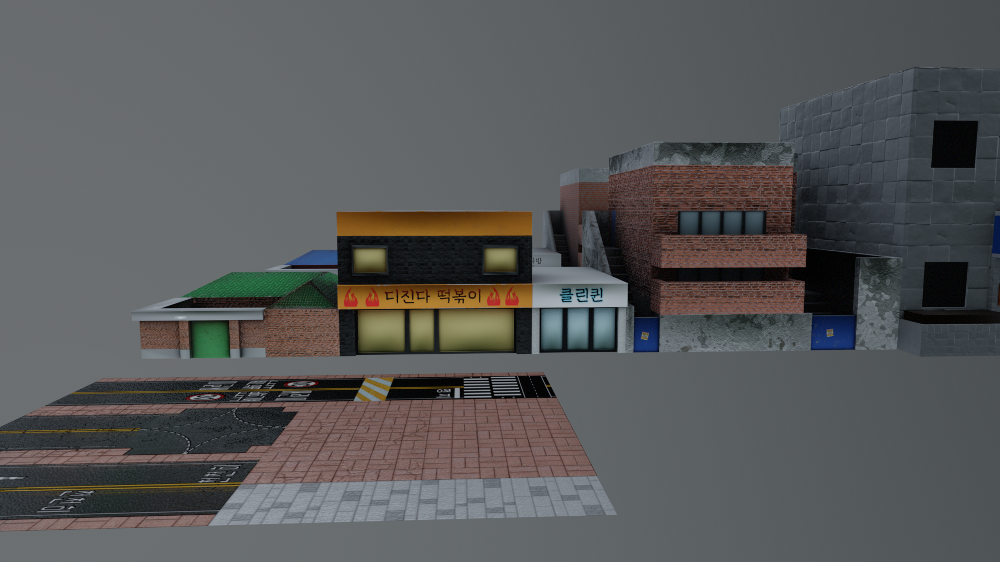
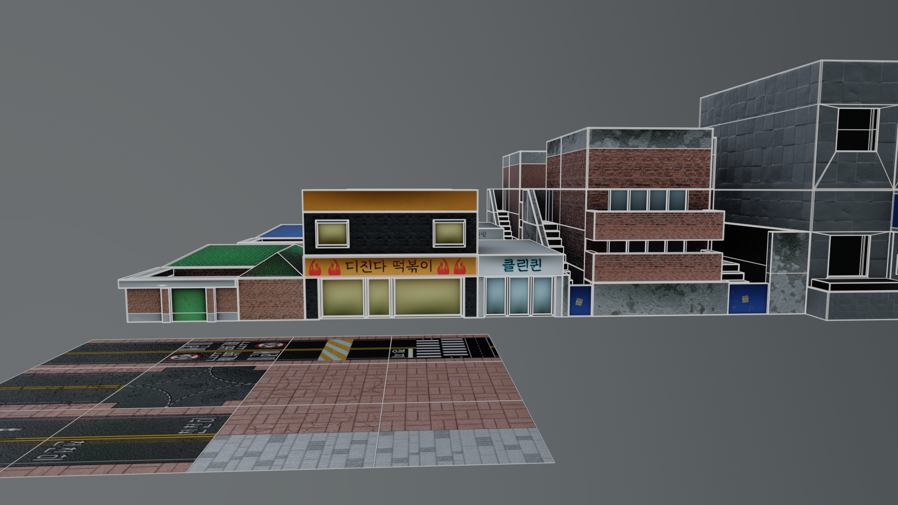
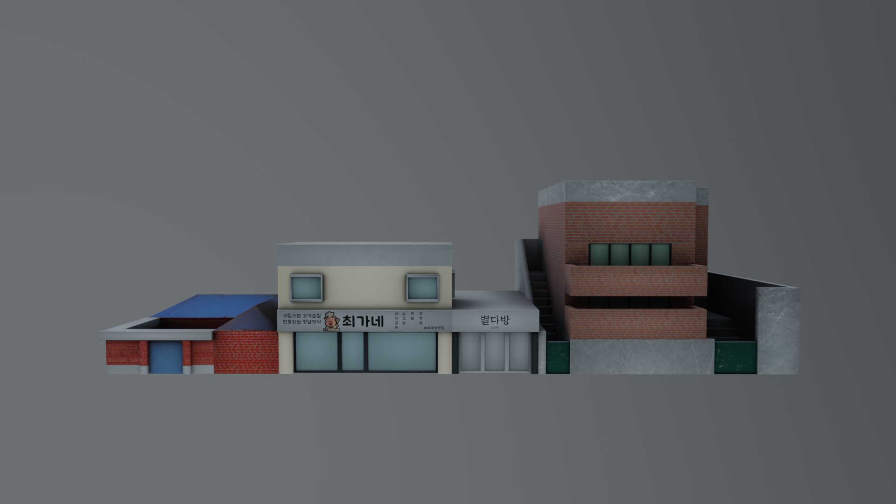
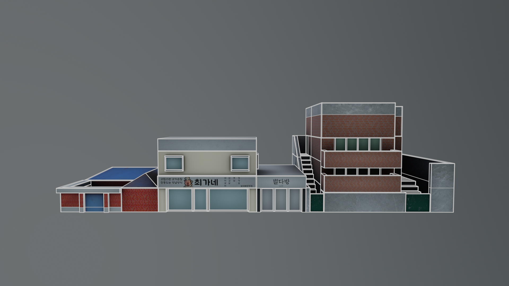
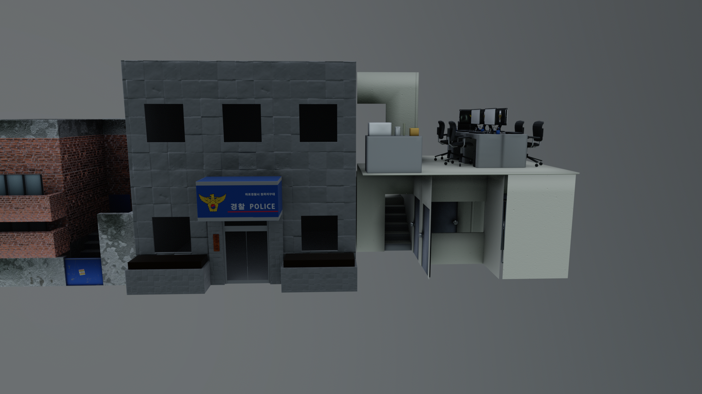
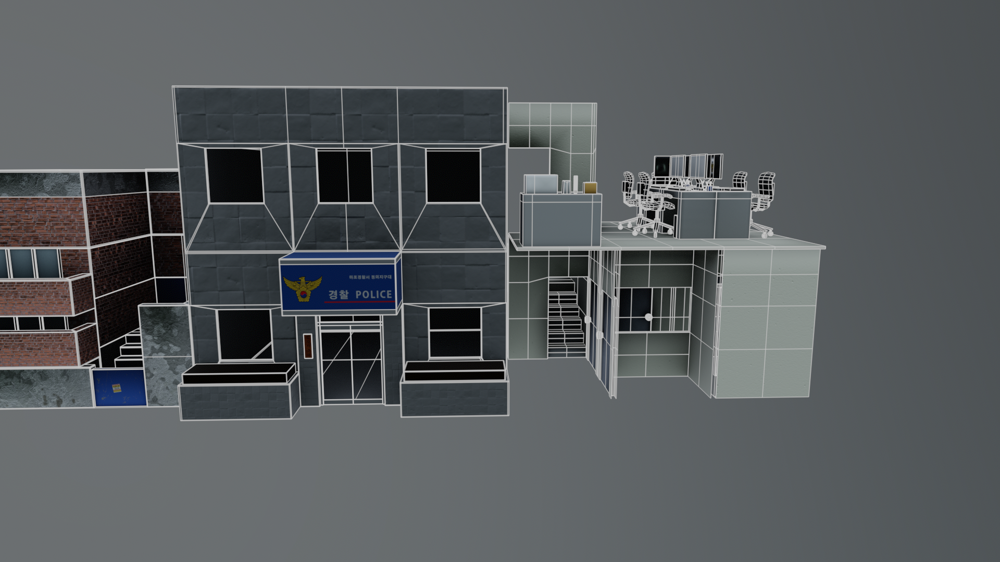
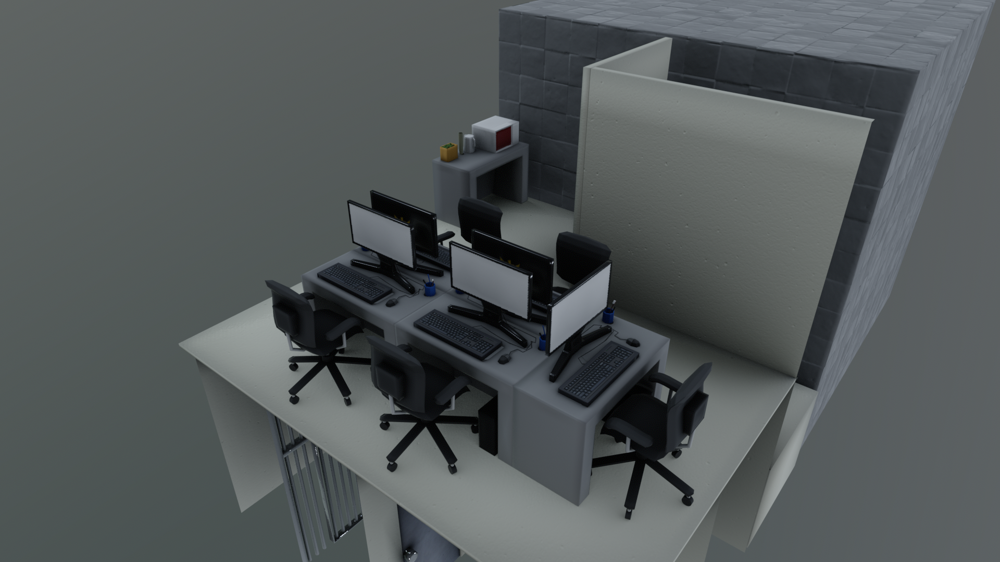
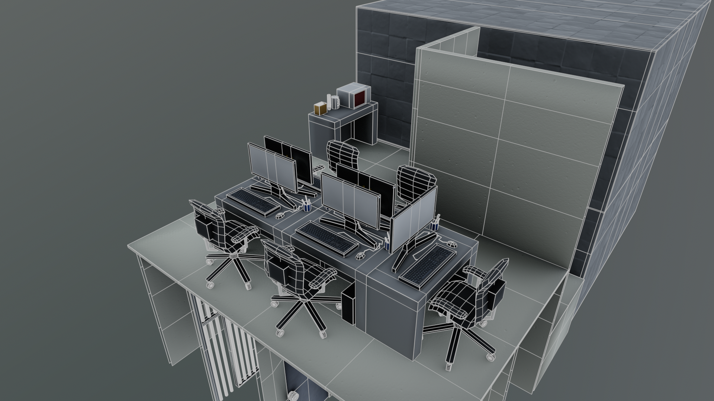
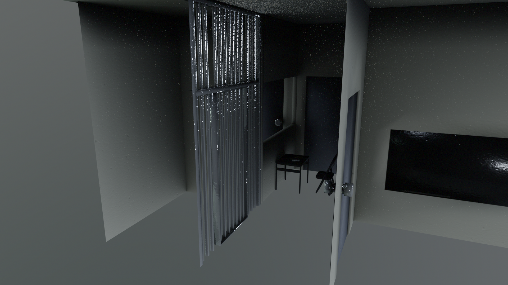
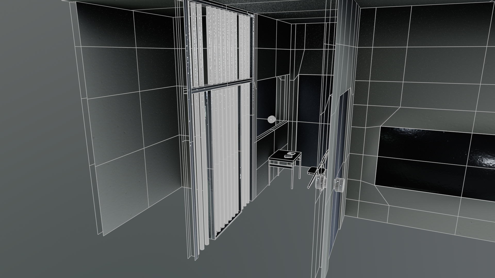

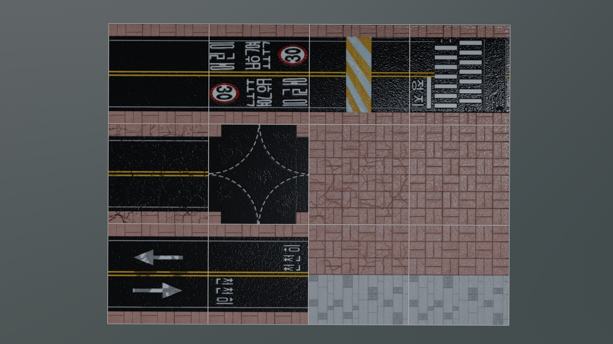

- Modeling : 3Ds Max
- Texture : Photoshop, Substance3DPainter
- Rendering : Unity, Marmoset

