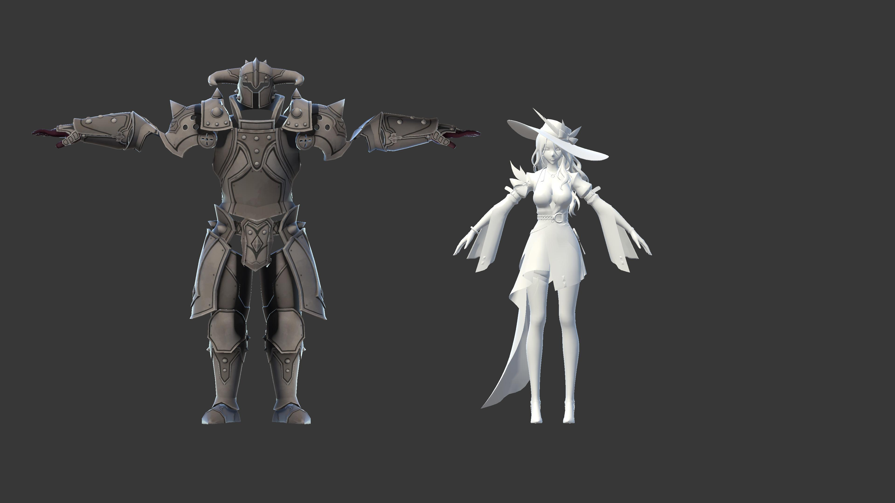
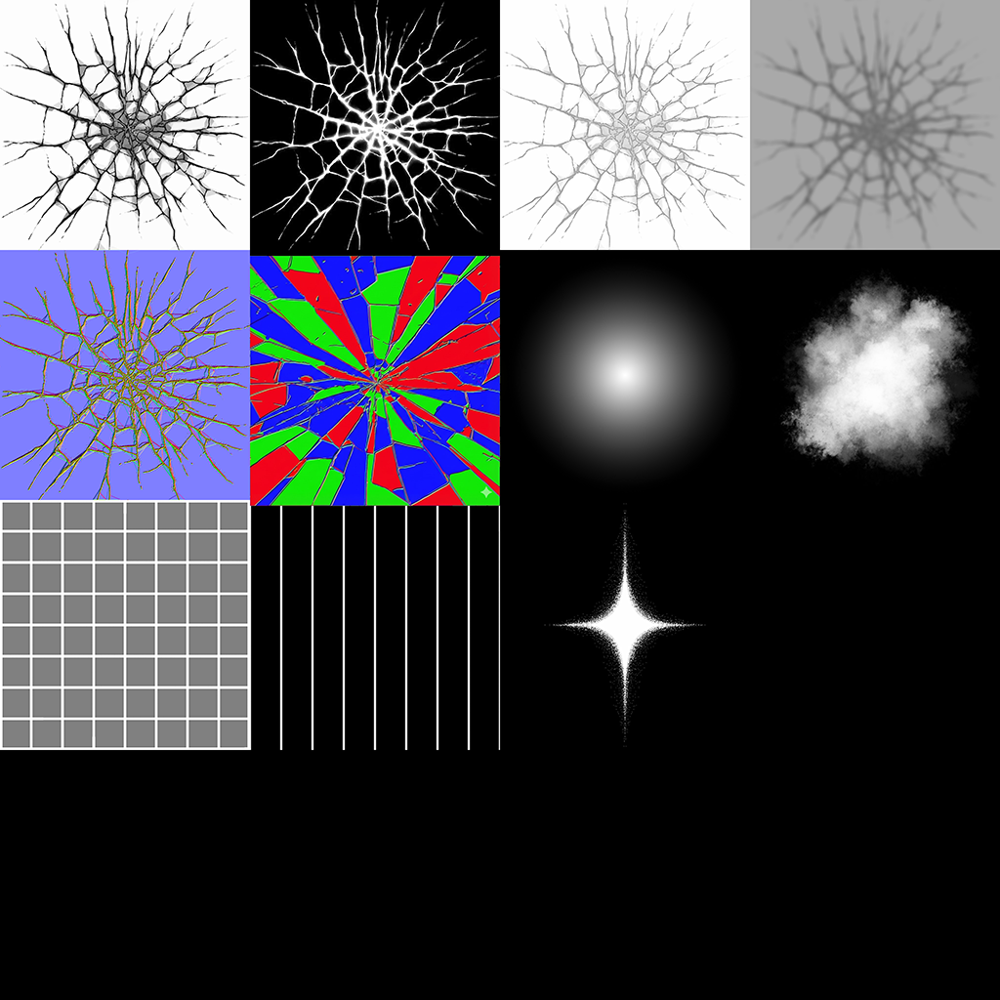
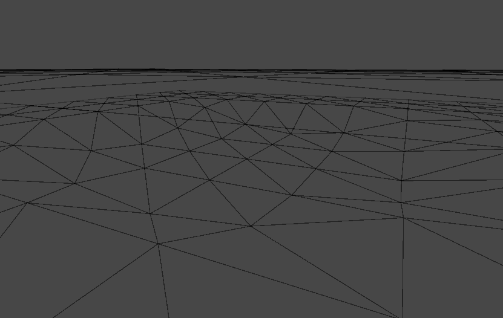
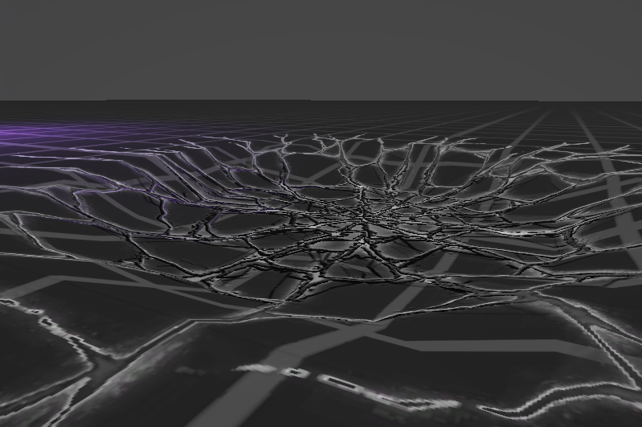

# Skill Sequence
Unity6 URP VFXGraph Skill Sequence

## characters

- knight : [Sketchfab](https://sketchfab.com/3d-models/bulky-knight-002a90cbf12941b792f9685546a7502c)
- Jade : HonkaiStarRail (Hoyoverse)

## animations 
- mixamo
- rokoko

## texture

- handpaint and adjust in photoshop.

## 3d model
- 3dsmax

---
## V.01
- Set animations and timing.
- Add Dissolve FX at spawn and dead.
- add eye light and smoke FX to knight.

<video controls loop = "" muted ="" autoplay = ""><source src ="https://github.com/kingJ0/kingJ0.github.io/raw/refs/heads/main/src/content/posts/video/MagicSeq_01_001.mp4"></video>

---
## V.02
- Set environment lightning, fog, postprocess
- Adjust colors.
- Change walk animations.
- Add skill FX.
- Add Displacement FX at crash.

### Spawn
<video controls loop = "" muted ="" autoplay = ""><source src ="https://github.com/kingJ0/kingJ0.github.io/raw/refs/heads/main/src/content/posts/video/MagicSeq_01_003.mp4"></video>
### Crash

Displacement Shader(Vertex position)
<video controls loop = "" muted ="" autoplay = ""><source src ="https://github.com/kingJ0/kingJ0.github.io/raw/refs/heads/main/src/content/posts/video/MagicSeq_01_005.mp4"></video>
### Full
<video controls loop = "" muted ="" autoplay = ""><source src ="https://github.com/kingJ0/kingJ0.github.io/raw/refs/heads/main/src/content/posts/video/MagicSeq_01_004.mp4"></video>