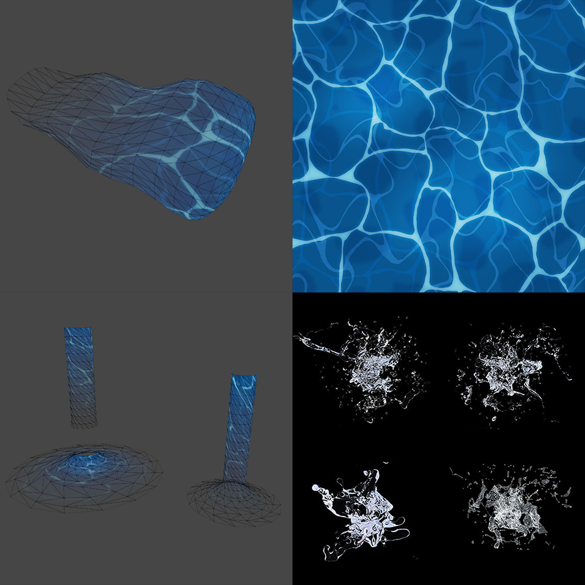

# Casual pirate ship Props
Unity6 URP

stylized Water effect

sculpt and uv mapping on 3DsMax

# VFX

- default wave shader
<video controls loop = "" muted ="" autoplay = ""><source src ="https://github.com/kingJ0/kingJ0.github.io/raw/refs/heads/main/src/content/posts/video/StylizedWater_001.mp4"></video>

- water whirlpool (particle system)
<video controls loop = "" muted ="" autoplay = ""><source src ="https://github.com/kingJ0/kingJ0.github.io/raw/refs/heads/main/src/content/posts/video/StylizedWater_003.mp4"></video>

- wave (vfx graph)
<video controls loop = "" muted ="" autoplay = ""><source src ="https://github.com/kingJ0/kingJ0.github.io/raw/refs/heads/main/src/content/posts/video/StylizedWater_002.mp4"></video>

