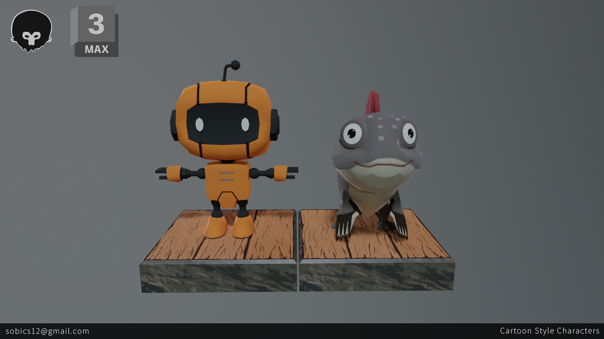
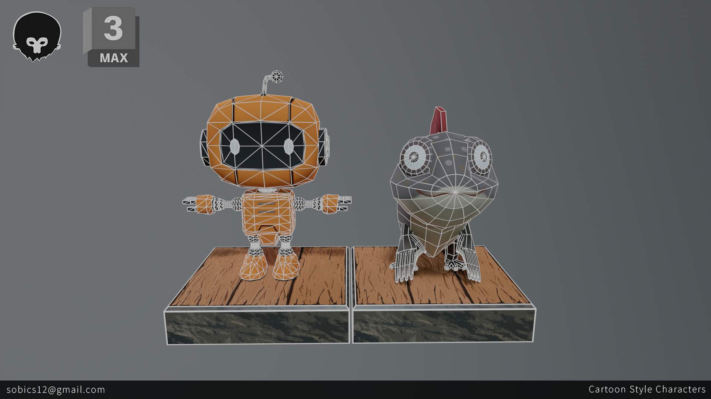
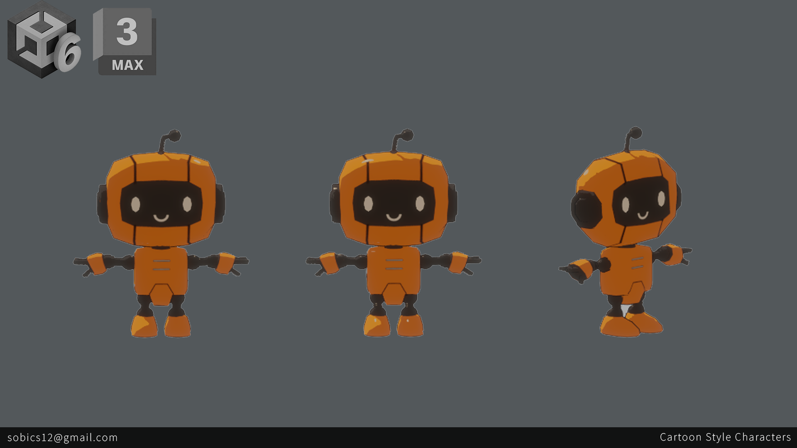
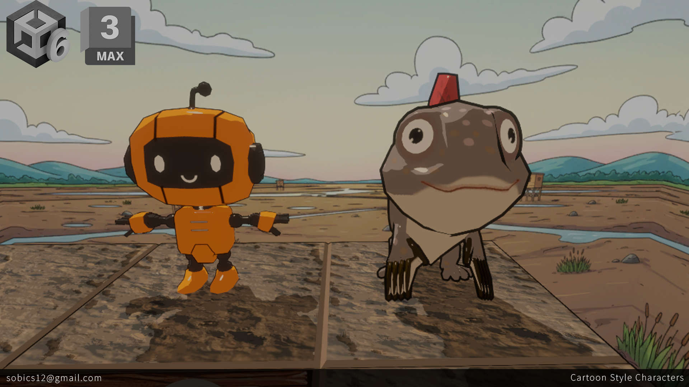

# Characters
이 에셋들은 2025 순천 AI게임잼(25-09-26~25-09-28)에 참여하여 제출된 게임의 에셋입니다.

게임의 컨셉은 "HELLTAKER"와 비슷한 퍼즐게임으로, 요구된 에셋은 3D Low poly 모델이며 카툰 쉐이더를 사용할 예정이었습니다. 따라서 캐릭터를 3DsMax에서 모델링 하고, biped를 통해 리깅을 했고, photoshop에서 텍스처링을 했습니다. 애니메이션은 Mixamo의 애니메이션을 적용했습니다.

캐릭터는 2종으로 게임의 주인공이자 배달로봇인 "순천만" 그리고, 배달업체 사장인 짱뚱어 캐릭터를 디자인하였습니다.

이 캐릭터들이 적용된 게임은 [순천만딜리버리](https://j0choi.itch.io/scm) 에서 확인이 가능합니다.

---
These assets were created for a game submitted to the 2025 Suncheon AI Game Jam(25-09-26~25-09-28).

The game concept is a puzzle game similar to "HELLTAKER," with a requirement for 3D low-poly models intended for use with a cartoon shader. Accordingly, the characters were modeled in 3ds Max, rigged using Biped, and textured in Photoshop. Animations from Mixamo were applied.

Two characters were designed: "Suncheonman," the protagonist and a delivery robot, and a mudskipper character who is the CEO of the delivery company.

The game featuring these characters can be viewed here:[SuncheonBay Delivery](https://j0choi.itch.io/scm)

---

- Modeling : 3Ds Max
- Texture : Photoshop
- Rendering : Unity, Marmoset

