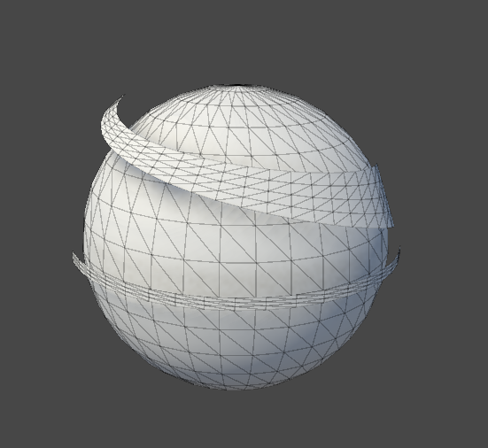
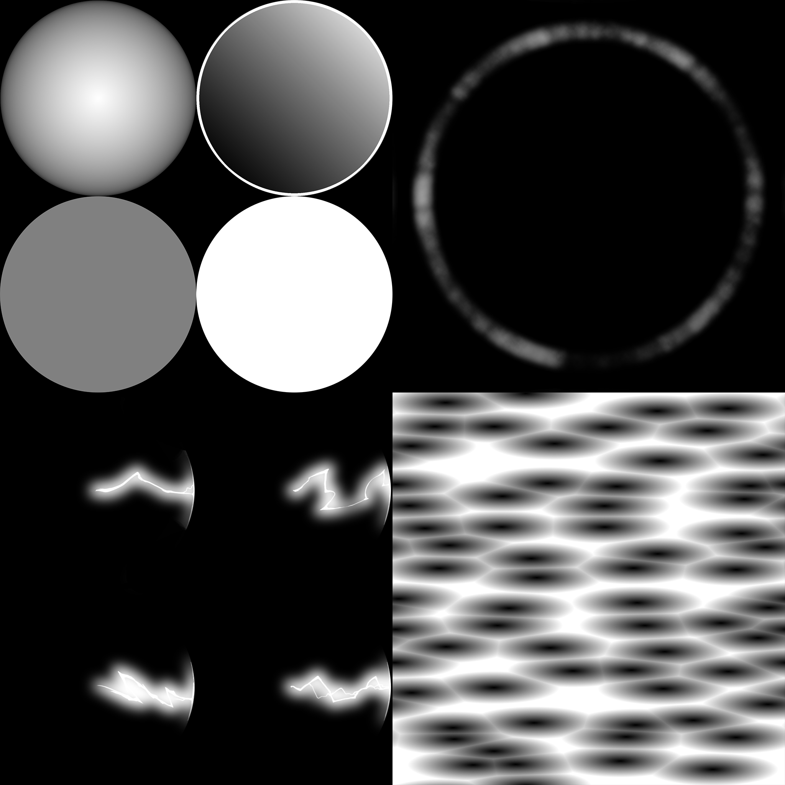
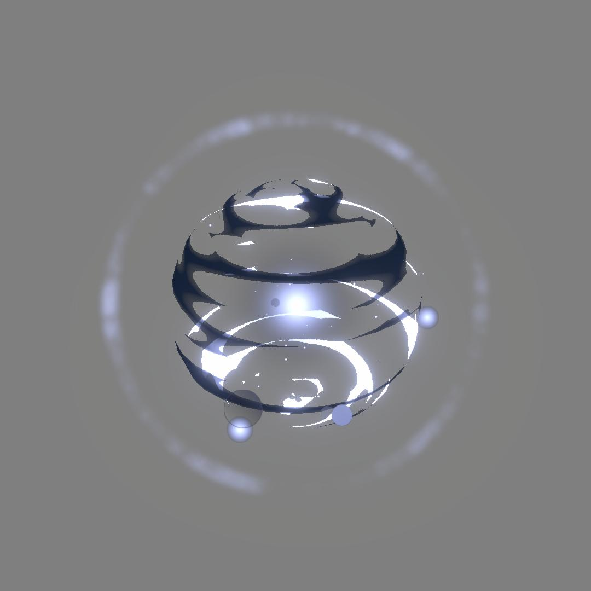
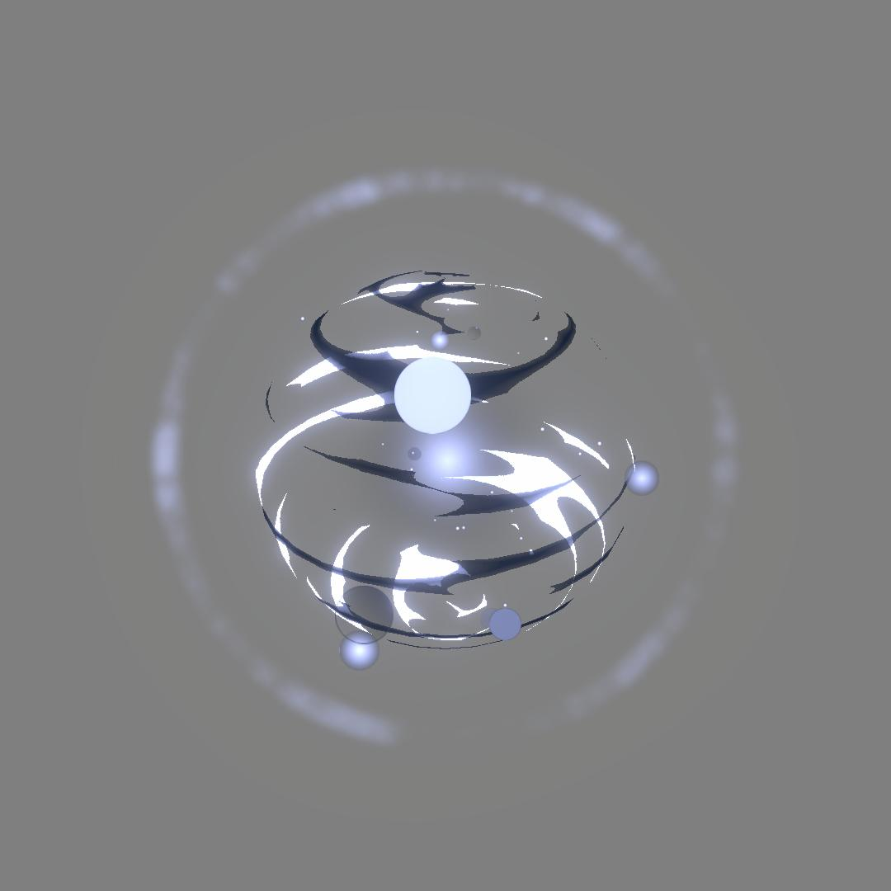
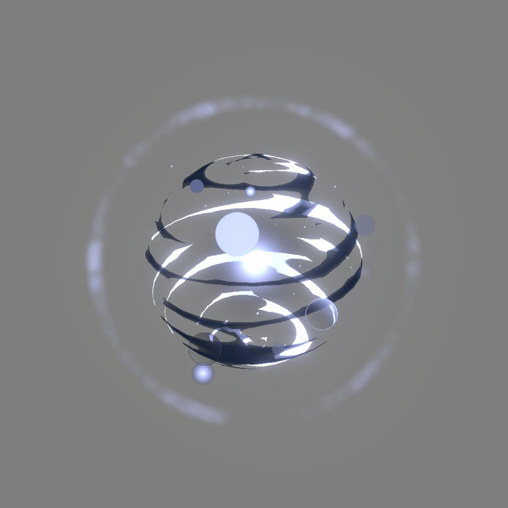
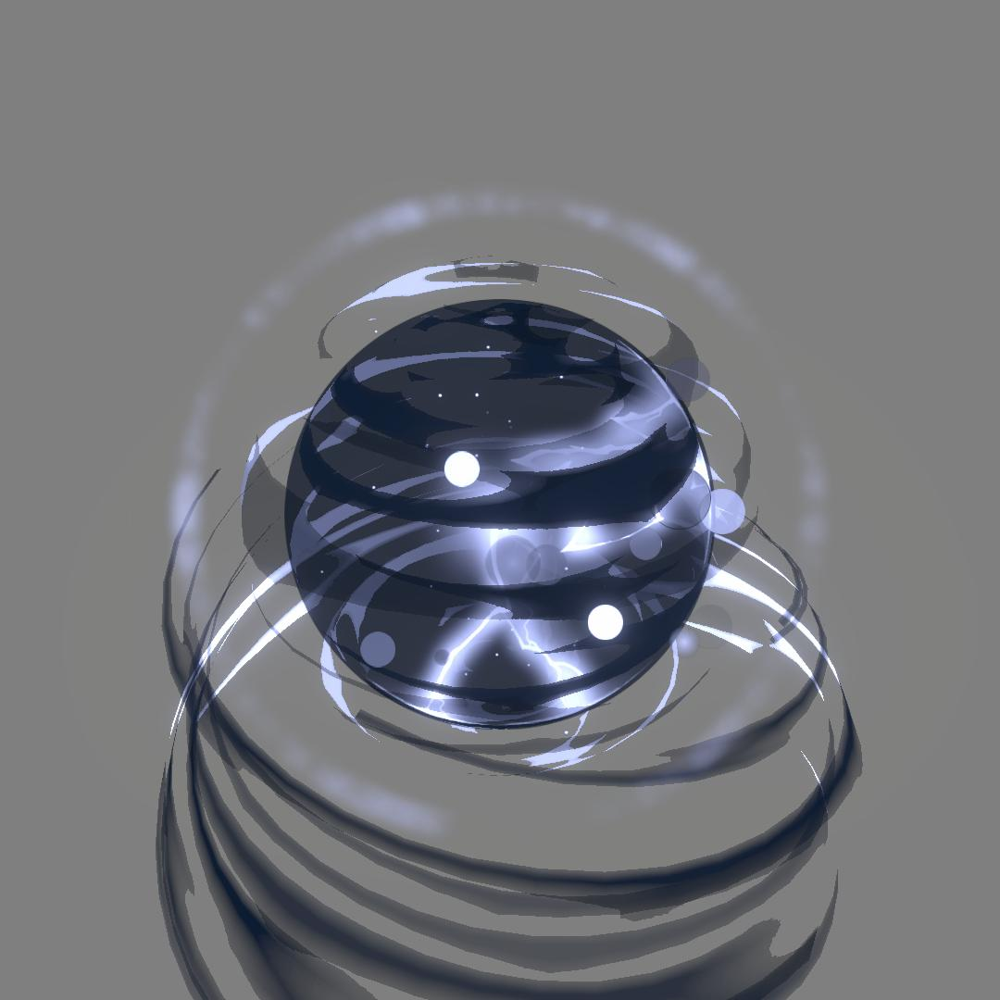
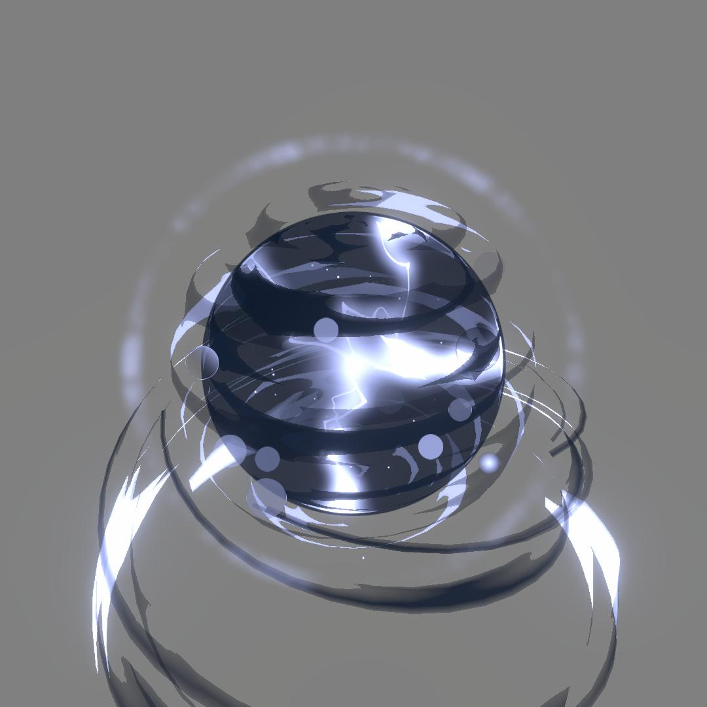
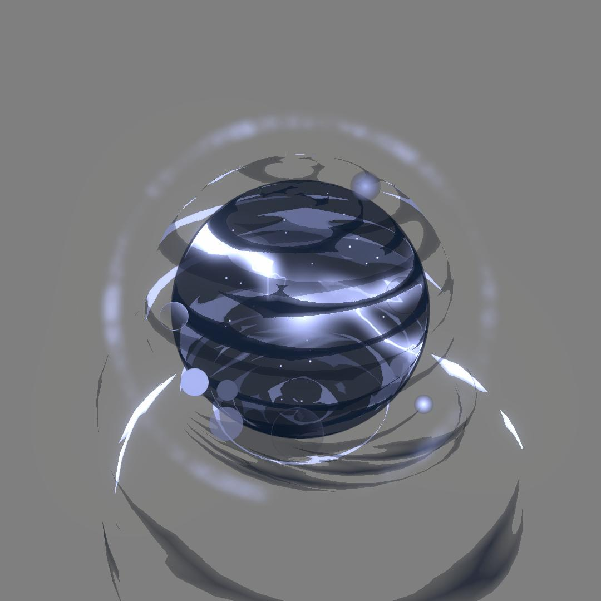

# stylized orb
Unity6 URP VFXGraph stylized orb

sculpt and uv mapping on 3DsMax

handpaint in photoshop. voronoi texture from Material Maker.

# VFX

## V.01
- Center Light
- Sphere Shader
- small particles
- Bokeh effect
- Light dispersion effect

## V.02
I want this orb have certain sphere shape and more property inside orb.
- Outside Sphere
- interior darkness
- interior lightning
- outside wrapper

<video controls loop = "" muted ="" autoplay = ""><source src ="https://github.com/kingJ0/kingJ0.github.io/raw/refs/heads/main/src/content/posts/video/orb2_006.mp4"></video>

## V.03
I want more chaotic effect

(WIP)